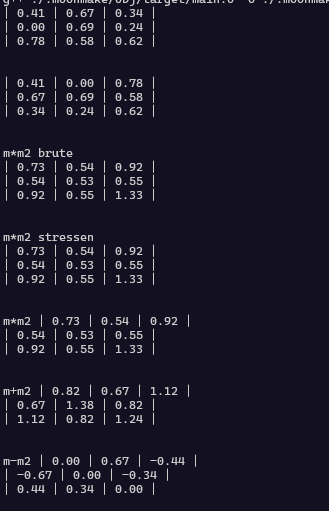

# MatrixCPP

its a simple library that i developed to learn more about matrices,
I also used this to learn more about c++ and how it works.
Its a simple project, and it doesnt needs that many explanations.

the build script uses [moonmake](https://github.com/ranon-rat/moonmake)
a building system that I developed using python, feel free to explore.

